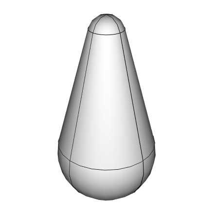

# python-capsule-shape

A simple module to create a renderable capsule shape for python.

[](#)

## Install

This module is **not available through pip**, it was designed to be forked and extended. Simplicity is a key goal in design. This module is using [glm](https://glm.g-truc.net/) and the Python's [c-api](https://docs.python.org/3/c-api/). The implementation can be found in the [capsule_shape.cpp](capsule_shape.cpp).

```
git clone https://github.com/cprogrammer1994/python-capsule-shape
cd python-capsule-shape
python setup.py develop
```

## Cheat Sheet

```py
import capsule_shape

mesh, index = capsule_shape.capsule_mesh((0.0, 0.0, 0.0), (0.0, 0.0, 3.0), 1.2, 0.4)
# mesh is a bytes object containing vertices and normals
# index is a bytes object containing indexes for indexed rendering

points, index = capsule_shape.capsule_lines((0.0, 0.0, 0.0), (0.0, 0.0, 3.0), 1.2, 0.4)
# points is a bytes object containing vertices
# index is a bytes object containing indexes for indexed rendering

distance = capsule_shape.distance((0.0, 0.0, 0.0), (0.0, 0.0, 3.0), 1.2, 0.4, point=(2.0, 0.0, 1.5))
```
